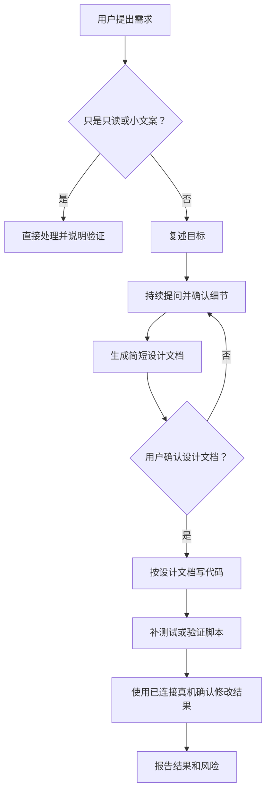
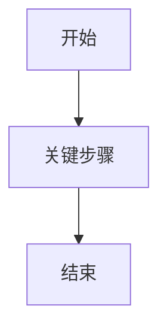

# Agent Context

这个项目是一个本地运行的“携程 App 机票价格监控助手”。后端用 FastAPI 提供网页面板和 API，APScheduler 定时触发任务，核心爬虫用 `uiautomator2` 操控一台安卓手机上的携程 App，结果写入本地 SQLite 数据库 `tracker.db`，前端静态文件在 `static/`。

## 需求确认与实施门禁

目标：新功能和行为变更必须先问清楚、写出设计文档、让用户确认，再写代码。不要用“大块 1/2/3”这种不便阅读的写法。

### 什么时候需要先确认

需要先确认：
- 新功能。
- 改用户看得见的行为。
- 改手机自动化流程。
- 改数据库结构。
- 改通知、价格判断、任务调度。
- 需求里有多个合理方案。

可以直接处理：
- 只读排查。
- 简单解释。
- 小文案修正。
- 用户明确说明“这个小改动不需要设计文档”的低风险修改。

### 工作流程图



### 必须问清楚什么

- 目标：这次到底要解决什么问题。
- 用户可见行为：页面、按钮、日志、通知、手机动作会怎么变。
- 默认值：没有输入时按什么规则处理。
- 异常情况：失败、超时、锁屏、无航班、无网络时怎么做。
- 数据：是否保存、保存在哪里、是否影响旧数据。
- 测试：怎么证明功能正确。
- 不做什么：这次明确不处理的范围。

### 设计文档怎么写

需要设计文档时，写到 `docs/designs/<YYYY-MM-DD>-<主题>.md`。文档必须短、清楚，并带一张图片、截图、Mermaid 图或简单示意图。模板：

````markdown
# <需求名称>

目标：
- <一句话说明要解决什么>

确认结果：
- <已经和用户确认的决定>

设计图：


实施步骤：
1. <步骤名称>：做什么，完成后用户能看到什么。
2. <步骤名称>：做什么，完成后用户能看到什么。

需要你确认：
- <还没确认的问题；没有就写“无”>

验收方式：
- <怎么证明它好了>

不做：
- <这次明确不处理什么>

用户确认：
- 状态：未确认
- 确认原文：
````

### 编码放行规则

- 没有设计文档时，不开始写新功能代码。
- 设计文档里还有“需要你确认”的问题时，不开始写代码。
- 用户没有明确确认设计文档前，不替用户决定默认值、交互、通知条件、数据保存、安全策略。
- 用户说“你决定”时，只代表该问题授权给 AI；不能扩大到其他问题。
- 用户确认后，把设计文档里的“状态”改为“已确认”，并记录确认原文。
- 实施中发现新问题，先停下说明，更新设计文档，再让用户确认。
- 代码实现必须贴合已确认的设计文档；如果要偏离文档，先更新文档并再次确认。

## 快速运行

- 工作目录：`/Users/kouunryuu/TLINK/tiket`
- 虚拟环境：`./venv`
- 启动服务：`./venv/bin/python main.py`
- 备用启动：`./venv/bin/uvicorn main:app --host 0.0.0.0 --port 8000 --reload`
- 打开面板：`http://localhost:8000/`
- 单独测试爬虫：`./venv/bin/python mobile_crawler.py <出发城市> <到达城市> <YYYY-MM-DD>`
- 语法检查：`./venv/bin/python -m py_compile main.py db.py scheduler.py mobile_crawler.py notifier.py`

主要依赖已经安装在虚拟环境中：FastAPI、uvicorn、APScheduler、uiautomator2、Pillow、requests。项目已有 `requirements.txt`、`README.md` 和 Git 仓库。

## Git 操作规约

- 没有用户明确指令时，不得执行 `git commit`、`git push`、`git tag` 或改写远程历史。
- 常规代码修改完成后，只能报告待提交文件和建议提交信息，等待用户明确要求提交。
- 可以执行只读 Git 命令，例如 `git status`、`git diff`、`git log`、`git remote -v`。
- 需要提交时，先确认不会纳入 `tracker.db`、`server.log`、截图、虚拟环境、PIN、通知 key 或其他运行敏感数据。

## 测试规约

- 每完成一个修改需求，无论风险等级或是否直接涉及手机自动化，Agent 都必须亲自使用已连接的真实设备确认修改结果后，才能宣称该需求完成。真机确认应覆盖本次修改对应的用户可见行为或实际运行路径，不能只确认设备已连接、应用能启动或服务能响应。
- 真机确认必须记录验证对象、操作路径和实际结果，并在最终回复中明确写出 PASS 或 FAIL。若修改不直接作用于手机端，应仍通过真机访问对应页面、触发相关任务或观察最终运行结果，确认完整链路符合预期。
- 如果设备、网络、账号、权限或运行环境导致真机确认无法执行，必须明确报告阻塞和已经完成的离线验证，不得宣称需求已完成，也不得把真机确认步骤仅留给用户。
- 每完成一个用户追加的新功能，都必须同步新增或更新一个可运行的测试、验证脚本或明确的验证命令。
- 测试应尽量覆盖该功能的核心成功路径和关键边界条件；如果涉及手机 UI 自动化且无法稳定自动测，至少补离线单元测试或可重复执行的最小验证脚本。
- 涉及手机 UI 自动化、手机导航、锁屏/熄屏、日期坐标或真机页面解析的实现，代码写完并通过离线测试后，Agent 必须亲自使用已连接的真实设备完成验证并记录结果，不得只把“人工验证步骤”留给用户；如果设备、网络或权限不可用，必须明确报告阻塞，不能宣称任务已完成。
- 不要用真实 `tracker.db` 做破坏性测试；需要数据库时使用临时文件、内存库或可清理的测试数据。
- 修复线上或已知 bug 时，必须新增或更新一个“修复前会失败、修复后会通过”的回归测试；如果真实手机 UI 无法自动复现，至少用 fake device、截图解析样例、UI hierarchy fixture 或最小验证脚本覆盖旧失败模式。
- 测试文件命名优先使用 `test_<feature_or_bug>.py`；涉及手机自动化的测试应默认离线运行，不应在导入时连接真实手机、启动携程或写入真实数据库。
- 测试中如需替换 `db.add_log`、`time.sleep`、`uiautomator2` 设备对象，应显式 monkeypatch/fake，避免污染真实运行状态。
- 最终回复必须说明执行了哪些测试、命令是什么、结果如何；如果某项测试因设备、网络或权限无法运行，必须明确说明原因和剩余风险。

### 风险等级与最低验证

| 风险 | 示例 | 最低验证 |
|---|---|---|
| 低 | 文档、日志文案、孤立前端样式、不影响行为的小清理 | `git diff --check`；如涉及 Python 文件，运行 `py_compile`；真机确认对应结果 |
| 中 | 前端 API 调用、数据库读写逻辑、通知逻辑、价格解析 helper、调度器参数 | 聚焦测试脚本 + `./venv/bin/python -m py_compile main.py db.py scheduler.py mobile_crawler.py notifier.py` + 真机完整链路确认 |
| 高 | 手机导航流程、锁屏/熄屏策略、日期坐标、航班价格解析主流程、数据库 schema、任务并发/锁 | 离线回归测试 + 语法检查 + 真实设备确认；必要时先暂停活跃任务或在单条路线验证 |

### 验证矩阵

| 改动类型 | 推荐验证 |
|---|---|
| FastAPI endpoint / 请求体 / 返回字段 | 使用 `curl` 或小脚本调用目标 API；检查 `static/app.js` 是否同步 |
| SQLite schema / 数据迁移 | 使用临时数据库或备份副本验证迁移；不得破坏真实 `tracker.db` |
| 调度器 / 全局锁 | 用 fake job 或短间隔验证任务注册/移除；确认不会并发操作同一手机 |
| 手机自动化导航 | 优先新增 fake device 测试；真实设备验证时记录路线、日期、截图和日志 |
| 屏幕解析 / 价格识别 | 用构造的 TextView/UI hierarchy 数据或截图案例做回归测试 |
| 锁屏 / 熄屏 / PIN 解锁 | 使用 fake device 测试点亮、解锁、熄屏、fallback 分支；真实设备只做最终确认 |
| 通知 | 使用 fake `requests` 或测试 key；不要把真实 key 写入代码或文档 |
| 前端展示 | 本地打开页面并检查对应 API；复杂交互补充浏览器手动验证步骤 |

## 接任务前检查

- 先读当前 `AGENTS.md`、`README.md` 和相关源码；如果任务涉及手机自动化，优先读 `mobile_crawler.py` 的相关函数和最近日志。
- 执行修改前先查看 `git status --short`，识别已有用户改动；不得回滚或覆盖无关改动。
- 判断风险等级、影响范围和最小验证命令；风险为中/高时，在动手前明确说明计划和验证方式。
- 如果任务需要产品行为、默认值、安全策略、数据保存、通知条件或用户可见文案的选择，必须先确认，不得用隐藏默认值补全。
- 若当前后端服务正在运行且修改会影响运行行为，说明是否需要重启；不要在用户未要求时随意杀进程，除非正在排查运行故障且需要恢复服务。

## 代码修改规约

- 优先做小而可验证的改动；不要把爬虫导航、数据库、前端 UI 和通知逻辑混在一个无边界修改里。
- 沿用当前项目的简单模块边界：API 在 `main.py`，数据库在 `db.py`，调度在 `scheduler.py`，手机自动化在 `mobile_crawler.py`，通知在 `notifier.py`，前端在 `static/`。
- 不要引入大型框架、ORM、前端构建链或新状态管理，除非用户明确要求并确认迁移成本。
- 对易碎的携程 UI 选择器和坐标，必须保留日志、fallback 和测试/验证说明；不要删除已有调试信息来“清爽化”代码。
- 对运行数据和隐私敏感内容保持隔离：不得提交 `tracker.db`、截图、日志、PIN、通知 key、设备序列号或真实个人行程信息。
- 生成的截图和临时 dump 默认视为运行产物；只有用户明确要求作为 fixture 且脱敏后才可纳入版本控制。

## 文档写作规约

- 用户提出新需求时，如果需要新增或修改文档，默认写得简单、易懂、短小，优先给可执行步骤和关键注意事项。
- 不写长篇背景说明，不堆砌模板，不把内部推理过程写进文档；除非用户明确要求详细版。
- 面向使用者的文档优先回答“怎么做、在哪里改、怎么验证、有什么风险”。
- 文档必须以人容易阅读为目标；新增或大幅修改面向用户的文档时，必须补充图片、截图、流程图、状态图或简单示意图。
- 如果能从本地页面、手机截图、日志截图中截取有帮助的图片，必须优先使用真实截图并标注关键区域。
- 无法获取真实截图时，必须使用 Mermaid、表格或简图补充说明，并在文档中简短说明为什么不能使用真实截图。
- 不为了装饰加图；图片必须服务于理解步骤、状态、数据流或故障定位。

## 完成报告模板

任务结束时按以下结构回复，除非任务非常小：

```text
日语：<用户上一句话的日语翻译>

变更:
- ...

验证:
- PASS: <命令>，<结果>
- NOT RUN: <命令>，原因：<原因>

说明:
- Git: 未提交 / 已按用户指令提交 <hash>
- 生成文件: 是/否
- 剩余风险: ...
- 建议下一步: ...
```

如果本轮只是只读调查，`变更` 写“无”；如果按规约不能提交 Git，必须明确说明“未提交 Git”。

## Review / 提交前检查清单

- 改动是否只有一个清晰目的，没有混入无关格式化或清理。
- 是否保护了用户已有改动，没有回滚非本轮修改。
- 是否新增或更新了与本轮功能/bug 对应的测试或验证脚本。
- 是否运行了风险匹配的验证命令，并记录结果。
- 是否更新了 `README.md`、`AGENTS.md` 或调试说明中受影响的运行方式。
- 是否确认 `.gitignore` 会排除数据库、截图、日志、虚拟环境和敏感信息。
- 如果用户要求提交，提交前再次检查 `git diff --stat` 和 `git status --short`。

## 核心文件

- `main.py`：FastAPI 应用入口。初始化数据库和调度器，提供路线、历史、设置、日志、任务状态 API，并挂载 `static/`。
- `db.py`：SQLite 访问层。数据库文件固定为项目根目录的 `tracker.db`。导入时会执行 `init_db()`。
- `scheduler.py`：全局 APScheduler。每条路线是一个 interval job；用 `device_lock` 串行化手机控制，避免多个任务同时操作同一台手机。
- `mobile_crawler.py`：核心手机自动化。连接安卓设备，打开携程，选择城市和日期，点击查询，解析航班列表屏幕文字，必要时截图。
- `notifier.py`：推送通知。支持 `serverchan`、`pushdeer`、`bark`，配置保存在数据库 `settings` 表。
- `static/index.html`、`static/app.js`、`static/style.css`：单页控制台。通过 REST API 添加路线、启停、手动触发、查看价格趋势和手机截图。

## 数据流

1. 前端 `POST /api/routes` 添加路线。
2. `db.add_route()` 写入 `routes`，默认 `is_active=1`。
3. `scheduler.add_route_job()` 注册定时任务，并 `trigger_route_now_async()` 立即后台抓取一次。
4. `run_crawl_job()` 读取路线，拿 `device_lock`，调用 `scrape_ctrip_mobile()`。
5. 爬虫返回航班列表后，`add_price_log()` 写入 `prices`。
6. 如果最低价低于 `target_price`，调用 `send_wechat_notification()` 推送，并保存达标航班详情截图到 `static/generated/target_*.png`。
7. 前端轮询 `/api/routes`、`/api/logs`、`/api/routes/{id}/history` 展示状态、日志、趋势和航班表。

## API 速查

- `GET /api/routes`：路线列表，附带最新最低价和最后检查时间。
- `POST /api/routes`：创建路线。请求体：`departure`、`arrival`、`date`、`target_price?`、`interval_minutes?`。
- `DELETE /api/routes/{route_id}`：删除路线和价格记录。
- `POST /api/routes/{route_id}/toggle`：启停路线。请求体：`is_active`。
- `POST /api/routes/{route_id}/trigger`：手动立即抓取。
- `GET /api/routes/{route_id}/history`：返回路线、所有价格记录、每次检查的最低价趋势。
- `GET/POST /api/settings`：读取/保存推送设置。
- `GET /api/logs`、`POST /api/logs/clear`：日志列表和清空。
- `GET /api/jobs`：APScheduler 当前任务和下次运行时间。

## 数据库表

- `routes`：`id`、`departure`、`arrival`、`date`、`target_price`、`interval_minutes`、`is_active`、`created_at`。
- `prices`：`route_id`、航班号、航司、起降时间、价格、检查时间、中转标记、过境签说明、截图路径。
- `settings`：键值配置，默认 `wechat_type=none`、`wechat_key=''`。
- `logs`：运行日志，前端默认显示最近 200 条。

## 爬虫实现要点

- `init_device()` 使用 `u2.connect()` 自动连接 USB 或局域网安卓设备。
- 连接设备后会调用 `configure_screen_sleep_policy()`，把熄屏时间设置为 1 分钟，并关闭插电常亮/stay-awake；每次爬取开始会唤醒手机，数字 PIN 锁屏默认输入 `0000`，可用 `ANDROID_UNLOCK_PIN` 覆盖；关键点击、解析、截图、滑动前会调用 `ensure_screen_on()`，防止运行中黑屏；爬取结束或异常退出后会调用 `sleep_device_when_idle()` 关闭携程并熄屏。不要把真实 PIN 写进代码或 Git。
- 操作 App 包名：`ctrip.android.view`。
- 城市选择优先用 content-desc：`depart city`、`arrival city`，失败后用固定坐标兜底。
- 日期选择支持双向月份滑动；优先点击可访问日期节点，否则按当前月“今天所在周”与未来月份首周计算 fallback 坐标，并在点击后校验日期文本。
- 查询按钮不要用 `textContains="查询"`，因为会误点“最近查询”。现有代码使用 `description="do inquire"`、精确文本和坐标兜底。
- 航班解析来自一次性 `dump_hierarchy()` 得到的可访问控件文字，不只扫 `android.widget.TextView`，因为携程主票价可能用其他控件暴露。不要用 `for el in d()` 逐个遍历控件，复杂页面会卡住并占用设备锁。解析时按 Y 坐标聚类，过滤广告横幅和底部排序栏，再用正则提取价格、时间、航班号、中转/过境签信息。价格不要取同一行最小数字；携程会显示“已优惠 ¥100”这类优惠金额，应优先取右侧主票价。
- 每次抓取滑动 4 屏，按 `(flight_number, price)` 去重，最后按价格升序返回。
- 第一屏会保存路线专属截图 `static/generated/screenshot_route_<route_id>.png`，并保留全局调试截图 `static/generated/screenshot.png`；达标价格会进入最低价航班详情页并保存全屏图到 `static/generated/target_*.png`。

## 易碎点和注意事项

- 这是 UI 自动化项目，携程 App 页面、文案、content-desc、日历布局或屏幕分辨率变化都会影响稳定性。
- `scheduler.scheduler` 在模块导入时就 `start()`，FastAPI lifespan 里再加载活跃路线。改调度器时注意不要重复启动或关闭。
- 所有手机操作必须继续走 `device_lock`，否则并发任务会互相干扰。
- `db.py` 的 `init_db()` 导入即执行；写测试或脚本时会触碰真实 `tracker.db`。
- `tracker.db` 是真实运行数据，已有路线、价格和大量日志；不要随意删除或重建。
- `static/generated/` 中有运行截图和调试截图，可能会被爬虫覆盖，尤其是 `static/generated/screenshot.png`。
- 前端依赖外部 CDN：Google Fonts、FontAwesome、Chart.js。离线环境下图标/图表可能无法加载。

## 调试脚本

`tools/device/` 下有多个一次性调试脚本，主要用于观察携程 UI 或验证自动化流程：

- `tools/device/debug_full_flow.py`、`debug_city_flow.py`、`debug_click_date.py`：流程/城市/日期选择调试。
- `tools/device/debug_calendar.py`、`debug_calendar_hierarchy.py`：日历布局分析。
- `tools/device/dump_current_screen.py`、`dump_inquire.py`、`dump_intl.py`、`debug_screen_dump.py`：屏幕和控件 dump。
- `tools/device/intl_search_smoke.py`、`one_way_smoke.py`、`back_to_search_dump.py`：携程页面入口和单程/查询测试。
- `tools/device/scheduler_smoke.py`：APScheduler 基础测试。

这些脚本多数会直接连接手机并启动携程 App，运行前确认设备可用；离线回归测试位于 `tests/unit/`，可用 `python -m unittest discover -s tests/unit -t .` 运行。

## 修改建议

- 后端接口改动后，检查 `static/app.js` 是否有对应 fetch 调用需要同步。
- 爬虫选择器或坐标改动后，优先用小脚本和截图验证，再接入 `scrape_ctrip_mobile()` 主流程。
- 数据库 schema 变更需要像现有 `prices` 字段一样保留轻量迁移，兼容已有 `tracker.db`。
- 如果要补依赖管理，优先从当前虚拟环境生成 `requirements.txt`，但要避免把调试/系统无关依赖误加进去。
