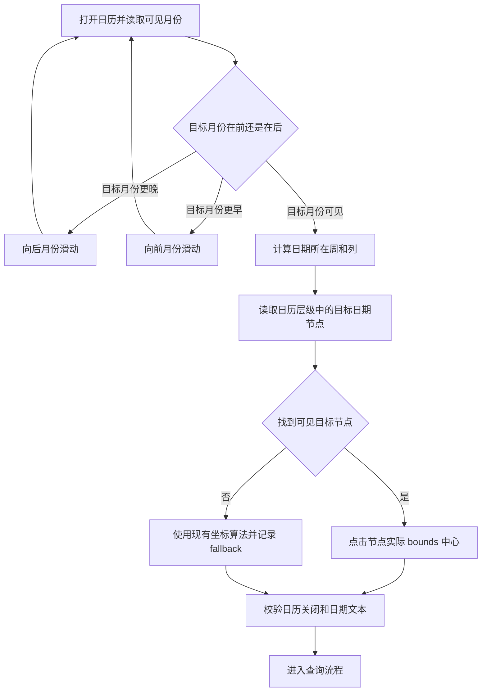

# 携程日期选择偏移修复

目标：
- 修复日志点击目标日期但查询结果进入下一周（例如 07-25 实际变成 08-01）的问题。

已确认现象：
- 2026-07-25 的计算坐标为 `(991, 1290)`，真机结果页显示为 08-01。
- 现有实现依赖固定的标题偏移和 178 像素行高，容易因携程日历实际行边界变化而点到下一行。
- 修复复测时发现，携程会记住上次错误选择的 08-01；再次打开日历可能只显示 08/09，而现有代码只向后月份滑动，找不到更早的 07 月。

设计图：

实施步骤：
1. 增加双向月份搜索：比较当前可见月份和目标月份，目标月份更早时向下滑动、更晚时向上滑动，最多保留有限次数避免无限滑动。
2. 增加日期节点定位：在目标月份标题下读取文本恰好等于目标日号的节点，按预期周/列距离筛选，使用节点实际 bounds 中心点击。
3. 保留安全 fallback：部分携程版本不暴露日期节点时继续使用现有坐标算法，并记录日志，避免盲目点击未知位置。
4. 增加回归测试：覆盖双向月份判断、07-25 节点实际位置与固定坐标不同、找不到节点时 fallback、月份边界日期筛选。
5. 真机验证：使用上海→广州、2026-07-25 路线，确认查询结果日期显示为 07-25，并再次验证最低价详情截图流程未回归。

需要你确认：
- 无；修复仅调整日期点击定位，不改变路线参数、目标价和截图业务规则。

验收方式：
- 日期节点存在时，日志显示使用节点 bounds 点击，查询结果日期与请求日期一致。
- 目标月份早于当前可见月份时，日志显示向前月份滑动并成功找到目标月份。
- 节点不可见时，fallback 分支可运行并有明确日志。
- 离线回归测试通过，真机 07-25 查询结果不再跳到 08-01。

不做：
- 不重写携程日历月份滚动策略。
- 不修改数据库、通知和航班详情截图逻辑。

用户确认：
- 状态：已确认
- 确认原文：确认补充方案
