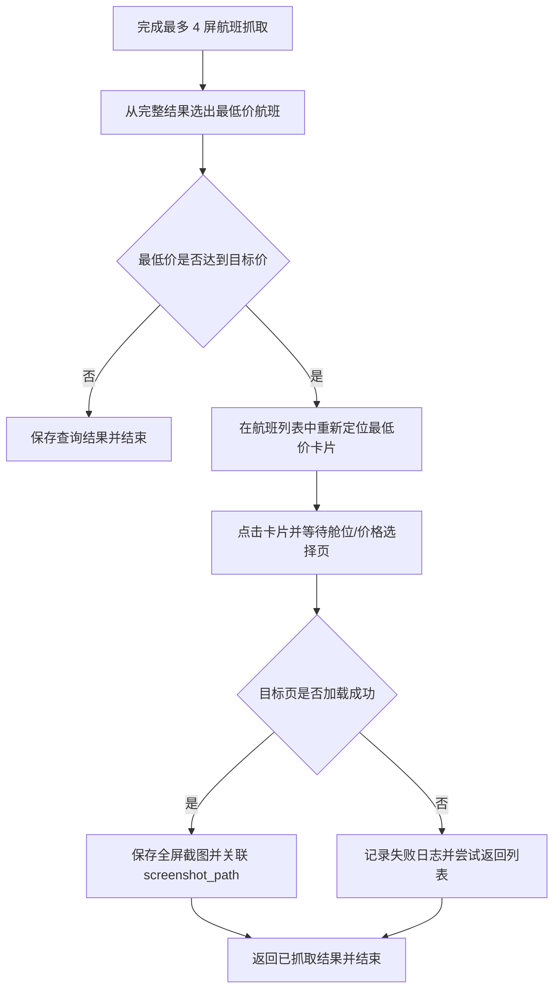

# 最低价机票详情页截图

目标：
- 当本次查询的最低价机票达到目标价时，点击该航班并进入舱位/价格选择页，保存目标页全屏截图。

确认结果：
- 只进入本次完整查询结果中的最低价机票。
- 目标画面是用户上传的航班舱位/价格选择页，页面包含航班摘要、经济舱及“订/选购”等价格卡片。
- 保存目标页全屏截图，并把路径写入该最低价航班现有的 `screenshot_path`。
- 点击、加载或截图失败时记录日志；能返回时返回航班列表，不影响已抓取结果继续入库。
- 只有最低价小于或等于路线目标价时才进入目标页；未设置目标价或未达标时保持现有查询流程。

设计图：

实施步骤：
1. 记录定位信息：抓取航班时保留最低价航班的航班号、价格、时间和卡片边界，用于完整抓取后的重新定位。
2. 重新定位并点击：从当前列表位置向上恢复并逐屏解析，匹配最低价航班后点击卡片中心；找不到时记录日志并保留原查询结果。
3. 识别目标页：等待航班摘要以及“经济舱”“订”或“选购”等目标页特征出现，避免截到加载页。
4. 保存截图：将目标页全屏图保存到 `static/target_*.png`，仅给最低价航班写入 `screenshot_path`。
5. 异常恢复：点击、等待或截图失败时记录明确日志，并在可行时返回航班列表；任务仍返回之前抓取到的航班。
6. 测试验证：新增 fake device 离线测试，覆盖达标、未达标、重新定位失败和目标页超时；通过后在已连接安卓设备上验证一次完整路径。

需要你确认：
- 无。

验收方式：
- 设置一条可达到目标价的路线并执行查询。
- 日志显示系统只选择完整结果中的最低价航班，并成功进入上传图片所示的舱位/价格选择页。
- `static/target_*.png` 是该目标页的全屏截图，数据库中只有最低价航班记录关联该路径。
- 模拟点击失败或目标页超时后，日志有失败原因，已抓取航班仍正常保存。

不做：
- 不点击“订”或“选购”进入下单流程。
- 不对每一张达标机票分别进入详情页或截图。
- 不改变最低价判断、通知条件、数据库结构和监控间隔。

用户确认：
- 状态：已确认
- 确认原文：1只进入最低价机票；2.画面已经上传；3.保存目标页全屏截图，并关联到该航班现有的 screenshot_path；4.记录失败日志、返回列表并继续；确认设计
