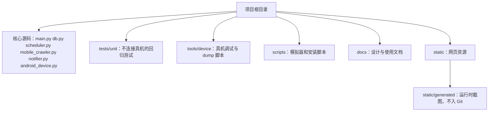

# 项目结构整理

目标：
- 让运行源码、离线测试、真机调试脚本、文档和运行产物分区清晰，同时保持现有启动命令和手机自动化导入方式稳定。

现状问题：
- 根目录混放核心模块、离线测试、会操作真机的调试脚本和屏幕 dump 脚本。
- `static/` 同时存放网页资源和运行时截图。
- README 的目录说明已经落后于实际文件数量。

推荐方案（轻量整理）：

实施范围：
1. 将 `test_date_selection.py`、`test_lowest_flight_detail.py`、`test_device_connection.py` 等离线测试移动到 `tests/unit/`，补充测试运行说明。
2. 将 `debug_*.py`、`dump_*.py` 以及会直接连接设备的手工测试脚本移动到 `tools/device/`，避免被误认为可自动运行的单元测试。
3. 保留核心 Python 模块在根目录，继续支持 `./venv/bin/python main.py`、`python mobile_crawler.py ...` 和现有相对导入，降低结构重构风险。
4. 将新生成的截图统一写入 `static/generated/`，保留 `/static/...` URL 兼容；更新 `.gitignore` 和 README。历史运行截图不自动删除。
5. 更新 README、AGENTS.md 中的目录树、测试命令和调试脚本路径。

不做：
- 本次不把核心模块改造成新的 Python package。
- 不删除已有调试脚本、数据库、截图或用户未提交改动。
- 不改变 API、数据库 schema、通知规则、调度行为和手机自动化业务逻辑。

验收方式：
- `tests/unit/` 中的离线测试可从项目根目录统一运行。
- 核心语法检查和现有启动入口继续可用。
- 真机调试脚本仍能按新路径手动执行。
- 新截图出现在 `static/generated/`，网页能通过对应静态 URL 访问。

需要你确认：
- 是否按上述“轻量整理”实施？

用户确认：
- 状态：已确认
- 确认原文：确认结构整理
